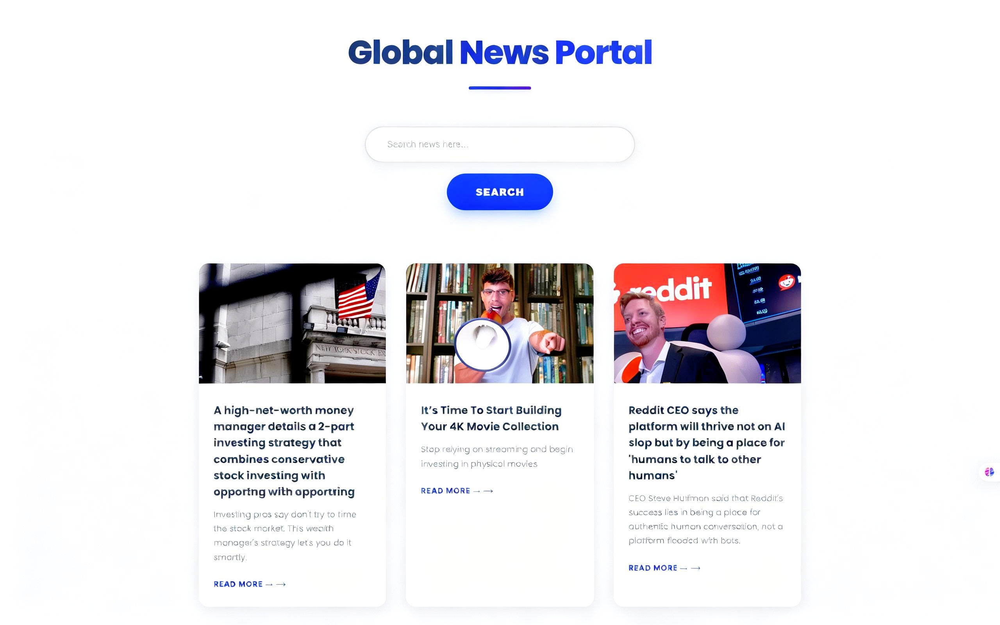

# Global News Portal 🌍

## 

## 🚀 Live Demo

_Check out the live application here:_ [👉 View Live Project](https://global-news-portal.vercel.app/) ---

## 📁 Repository Link

_Find the source code here:_ [📂 GitHub Repository](https://github.com/hmahmd/global-news-portal) ---

## 📝 Project Overview

This is a _Modern, Professional, and Fully Responsive_ News Portal. It is built using Vanilla JavaScript and integrates with a real-time News API to fetch the latest headlines from across the globe. Everything you see is dynamic—no data is hardcoded!

### 🌟 Key Features

- _Real-time API Integration:_ All news data is fetched live from a professional News API.
- _Smart Search Functionality:_ Search for any topic like Sports, Travelling, Epstein Files, Investing, Finance, and more.
- _Official Redirection:_ Click "Read More" to go directly to the official news website.
- _Full Responsiveness:_ Optimized for Desktop, Tablets, and Mobile screens.
- _Robust Error Handling:_
  - Displays "Please fill the field" if the input is empty.
  - Displays a "No results found" message if the API returns no data for a topic.

---

## 🛠️ How It Works

1. _Input:_ Type your desired topic in the sleek search bar.
2. _Action:_ Click the "Search" button or hit 'Enter'.
3. _Fetching:_ The app calls the API and generates clean, modern news cards.
4. _Read:_ Browse headlines and descriptions, then jump to the full story via external links.

---

## 🏗️ Tech Stack

- _HTML5:_ Semantic and clean structure.
- _CSS3:_ Modern UI with Grid, Flexbox, and smooth animations.
- _JavaScript (ES6):_ Dynamic DOM manipulation and Fetch API.

---

## 📬 Contact & Connect

I'd love to connect with you! If you have any feedback or want to collaborate, reach out via LinkedIn:

## [](https://www.linkedin.com/in/hmahmd/)

### 📜 License

This project is open-source and available under the MIT License.

Crafted with passion by [Your Name] ```

---
